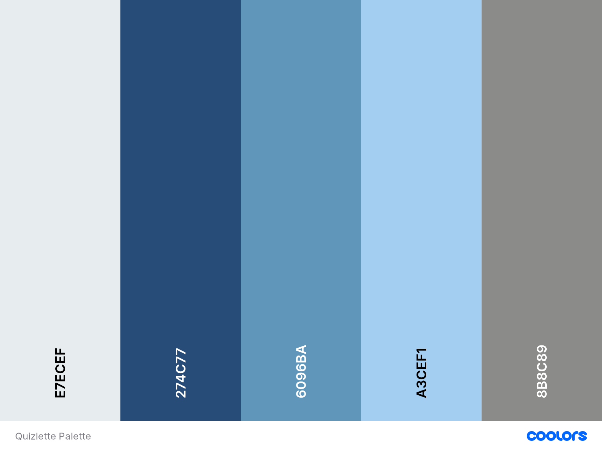

# Quizlette
How well do you know science and nature?

Take the quiz and find out!
A small web quiz to test your knowledge of  science and nature, just for fun.

Thank you for visiting my project, if you have any questions or feedback please head over to my Github contacts and get in touch.

---
## Table of contents 

* [UX](#ux)
    * [Site Owners Goals](#site-owners-goals)
    * [User Goals](#user-goals)
    * [User Stories](#user-stories)
    * [User Requirements and Expectations](#user-requirements-and-expectations)
    * [Design Choices](#design-choices)
* [Wireframes](#wireframes)
* [Features](#features)
    * [Existing Features](#existing-features)
    * [Features to be implemented](#features-to-be-implemented)
* [Technologies used](#technologies-used)
* [Testing](#testing)
* [Bugs](#bugs)
* [Deployment](#deployment)
* [Credits](#credits)


---

## UX

### Site Owner Goals
* A small easy to use quiz that will test users knowledge of science and nature.
* To be enganging to users and will encourage them to come back again to see if they have improved.
* The site is easy to navigate and simple to use.
* The site is aesthetically pleasing.

[Back to Top](#table-of-contents)

### User Goals
* To have a fun expreience learning new facts.
* To test their knowledge of science and nature.

### User Stories

* As a user, I want to be able to easily navigate the site.
* As a user, I want ro be able to see my score.
* As a user I expect the different game pages to have a cohesive design and layout.


[Back to Top](#table-of-contents)

### User Requirements and Expectations
#### Requirements
  * Easy to navigate, intuitive design
  * Visually appealing home page and game play
  * Keep the score of the player

#### Expectations
  * Questions are appropriate to the topics
  * Show user if the answer is right or not
  * Shows a running score of the users correct answers
  * Shows final Result
  * Shows a congratulatory message at the end of the game

[Back to Top](#table-of-contents)

---

### Design Choices
* Overview

   I wanted to keep the design clean and simple for the user to focus on the game.
   Unlimately I had to choose a different background image as the original was too busy and made it difficult for thuser to read questions and navigate the game.

* Fonts

   I used [Google Fonts](https://fonts.google.com/ "Google Fonts") to select the fonts used on the site.
   The fonts I chose were [KoHo](https://fonts.google.com/specimen/KoHo?query=koho "KoHo") for the main text to be used on the site and [Rock Salt](https://fonts.google.com/specimen/Rock+Salt?query=Rock+Salt "Rock Salt") for the text on the welcomepage as it
   has a softer feel and is more visually welcoming.
   
* Icons

   I used icons from the [Font Awesome library](https://fontawesome.com/ "Font Awesome") 
   
* Colours
   I used [Coolors](https://coolors.co/ "Coolors") to find the color palette for the site, I decided to go for a range of blues and greys as this is a
   subtle theme and will not be distracting to the user as they take the quiz.



  * #274C77- is a dark blue and will be used for the buttons
  * #6096BA- is a sea blue, this will be the main background color
  * #A3CEF1- is a cloud blue this will be used for borders and highlighting
  * #8B8C89- is a dove grey this will be used at the main text color as it contrasts well with the blue colors


[Back to Top](#table-of-contents)

### Wireframes

   I decided to use [Balamiq Wireframes](https://balsamiq.com/) to create my wireframes, 

   Wireframes can be view on the following links:

[Desktop Home Screen](wireframes/QuizletteDesktopHome.png)

[Desktop Game Screen](wireframes/QuizletteDesktopGame.png)

[Tablet Home Screen](wireframes/QuizletteTabletHome.png)

[Tablet Game Screen](wireframe/QuizletteTabletGame.png)

[Mobile Home Screen](wireframes/QuizletteMobileHome.png)

[Mobile Game Screen](wireframe/QuizletteMobileGame.png)

[Back to Top](#table-of-contents)

---

### Features 

* Use of [Open Trivia API](https://opentdb.com/ "Open Trivia")
* Validation of answers
* Ability to see score
* Results sreen with message at end of game

#### Features to be implemented

* More topics to be added- to make game moe specific, eg. mammals, birds, reptiles, etc.
* Ability to record high score to compete against
* The choice of difficlty of questions
* The ability to share your score on social media

[Back to Top](#table-of-contents)

---

### Technologies used
#### Languages

* HTML
* CSS
* Javascript


#### Libraries & Frameworks
* [Font Awesome](https://fontawesome.com/)
* [Google Fonts](https://fonts.google.com/)
* [Boot Strap](https://getbootstrap.com/)
* [Coolors](https://coolors.co/)
* [jQuery](https://jquery.com)

#### Technologies

* Git
* [GitPod] (https://github.com/)
* Balsamiq
* W3C HTML Validation Service
* W3C CSS Validation Service

[Back to Top](#table-of-contents)

---

### Testing

#### As a user, I want to be able to easily navigate the site.

  * Plan
  
    The plan was that by using JS the screens would move between the home view, the level choice, and the game screen.
  
  * Implementation
   
    The screen movement function turned out tricker to get working than expected, partly due to the home button for moving back to the home screen 
    at various point during the game used a class element rather than an ID as such it required an additional step of being turned into an array for the function to fire at 
    all stages rather than just the level page.
     
  * Test
  
    On initial testing the move screen function worked for all screens but only for the move back to the home screen from the level-screen, additionalsteps were added to the JS function 
    to allow the home button to work at all stages of the game. 

  * Result

    After testing again the function now fully works allowing the user to navigate smoothly through the game.
    
  * Verdict
    
    The move Screen function now works as expected and the user can navigate the game with ease.

#### As a user I expect the different game pages to have a cohesive design and layout.

  * Plan

  * Implementation

  * Test

  * Result

  * Verdict

#### As a user, I want ro be able to see my score.

  * Plan

  * Implementation

  * Test

  * Result

  * Verdict

#### To test their knowledge of science and nature.

  * Plan

  * Implementation

  * Test

  * Result

  * Verdict
  
  
[Back to Top](#table-of-contents)

---
### Bugs

#### MoveScreen function

    Initially the MoveScreen was working sporadically for the move back to the home section, then the end screen began to appear first. the end screen was apprearing too soon due to an additioanl line of code that I had written
    at the bottom of the sequence that was a duplicate and unneeded, once this line was removed the end screen now appears at the appropriate point in the game.

#### Home Button

    The home button was the cause of the glitch with the move screen function where the move back to the homse screen was not working on all the home buttons.
    the home button was a class of button as it appears in multiple places as such I added an additional step where the buttons were moved into an array and then the function was called on each of them.
    This was successful and the function now works at all locations.

  
[Back to Top](#table-of-contents)

---

### Deployment

This project was deployed via GitHub by executing the following steps.
After writing the code, committing and pushing it to GitHub:
* Navigate to the repository on github and click **Settings**.
* From there, go to the **Source section** within the Github Pages section.
* Select **master branch** on the dropdown menu, and click save.
* Now the website is live on:
```
https://yourgithubusername.github.io/your-repo-name
```
* Any time commits and pushes are sent to Github, the Github Pages site should update shortly after.
### **To run the project locally:**
1. Click the **green Clone or Download button** on the Github Repository
1. Using the **Clone with HTTPS option**, copy the link displayed.
1. Open your IDE, and ensure the Git Terminal is open.
1. Change the working directory to the location where the cloned directory is to go.
1. Use the **"git clone" command** and paste the url copied in the second step.


[Back to Top](#table-of-contents)

---

### Credits

  * [James Q Quick](https://www.youtube.com/c/jamesqquick)
  * [DevEd](https://www.youtube.com/channel/UClb90NQQcskPUGDIXsQEz5Q)
  * CI tutors & Simen
  * parents
  * Paul and Connie
  * My family

[Back to Top](#table-of-contents)
